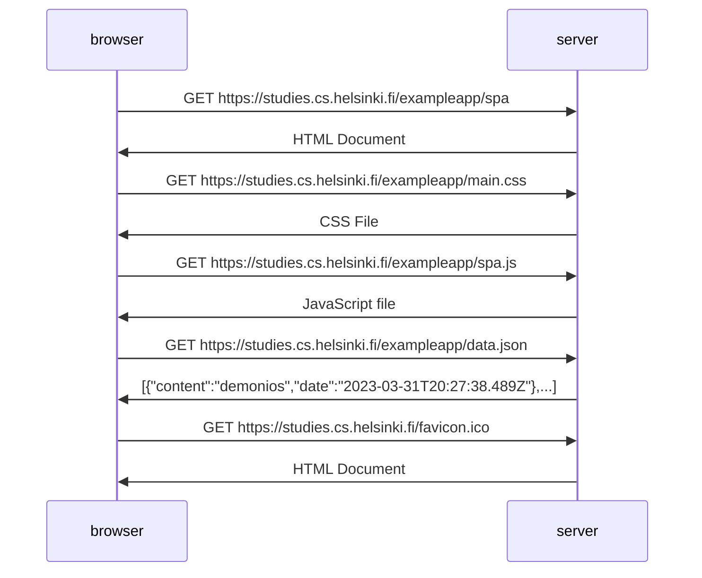

Osa0 tehtävä 0.5

```mermaid
sequenceDiagram;
    browser->>server: GET https://studies.cs.helsinki.fi/exampleapp/spa;
    server->>browser: HTML Document;
    
    browser->>server: GET https://studies.cs.helsinki.fi/exampleapp/main.css;
    server->>browser: CSS File;
    
    browser->>server: GET https://studies.cs.helsinki.fi/exampleapp/spa.js;
    server->>browser: JavaScript file
    
    browser->>server: GET https://studies.cs.helsinki.fi/exampleapp/data.json;
    server->>browser: [{"content":"demonios","date":"2023-03-31T20:27:38.489Z"},...]
    
    browser->>server: GET https://studies.cs.helsinki.fi/favicon.ico;
    server->>browser: HTML Document;
```
